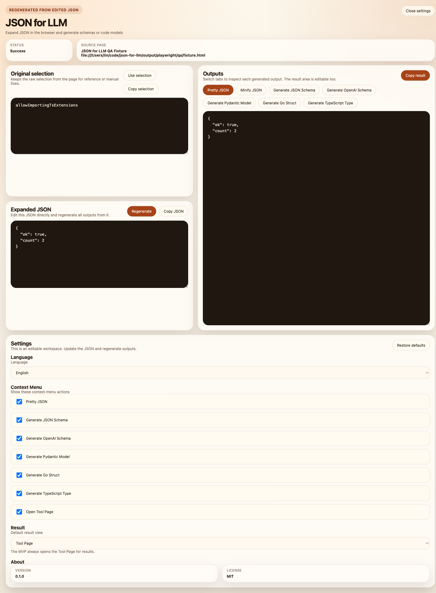

# JSON for LLM

[English](./README.md)

`JSON for LLM` 是一个面向 LLM 开发者的零构建 Manifest V3 浏览器扩展，适合在文档、日志、调试页面和 API 响应里直接处理 JSON。

你可以在网页上选中一段完整 JSON，或者只选中其中一小段，然后在不离开浏览器的情况下直接生成可复用结果：

- 格式化 JSON
- 压缩 JSON
- JSON 转义 / 反转义
- JSON Schema
- OpenAI Structured Output Schema
- Pydantic Model
- Go Struct
- TypeScript Type



## 为什么做这个

LLM 应用开发里，很多 JSON 工作都发生在浏览器里：

- 查看接口返回
- 检查日志与调试信息
- 提取 tool 参数示例
- 把示例 JSON 转成 schema 或类型定义

很多现有工具都要求你切去在线网站、IDE 或命令行，而 `JSON for LLM` 的目标是把这条高频链路尽量留在当前页面上下文中完成。

## 主要能力

- 将局部选中内容自动扩展为最近的合法 JSON 对象或数组。
- 兼容常见 JSON-like 字面量，例如 `True`、`False`、`None`。
- 基于同一份源 JSON 生成多种开发可直接复用的输出。
- 右键菜单可直接复制目标结果。
- 提供可编辑的 Tool Page 工作台，支持手动修正和重新生成。
- 使用 `chrome.storage.local` 保存配置。
- 可单独开关右键菜单项。
- 支持英文与简体中文界面。
- 支持调试模式，便于排查选区扩展问题。
- 保持 no-build 结构，方便本地加载和快速迭代。

## 工作流

1. 在网页上选中 JSON 或其中一部分内容
2. 右键选择 `JSON for LLM` 对应功能
3. 插件尝试把选中内容扩展成完整 JSON
4. 直接复制目标结果，或打开 Tool Page 继续处理
5. 在 Tool Page 中编辑源 JSON，并重新生成全部输出

## 本地安装

Chrome / Chromium：

1. 打开 `chrome://extensions`
2. 开启 `Developer mode`
3. 点击 `Load unpacked`
4. 选择仓库根目录

安装完成后可以：

- 在任意网页选中内容后通过右键菜单使用功能
- 点击扩展图标打开 Tool Page
- 进入扩展选项页调整语言、调试模式和菜单配置

## 当前输出能力

- `Pretty JSON`
- `Minify JSON`
- `Escape JSON`
- `Unescape JSON`
- `Generate JSON Schema`
- `Generate OpenAI Schema`
- `Generate Pydantic Model`
- `Generate Go Struct`
- `Generate TypeScript Type`

## 当前状态

这个仓库现在还处于 MVP 阶段，但已经能够覆盖很多日常浏览器内的 JSON 处理需求。

目前已实现：

- MV3 后台 service worker
- offscreen 剪贴板兜底
- 独立 Tool Page
- 独立 Options Page
- 本地配置持久化
- 中英双语界面
- release 打包脚本

下一步计划：

- 更完整的 OpenAI schema 兼容性校验
- JSONPath 辅助能力
- 更丰富的类型推断
- 历史记录 / 片段保存
- 更标准化的发布流程

## 仓库结构

```text
.
├── manifest.json
├── _locales/
├── assets/
├── scripts/
│   └── release.sh
└── src/
    ├── background/
    ├── offscreen/
    ├── options-page/
    ├── shared/
    └── tool-page/
```

## 开发说明

- 项目当前刻意保持 zero-build / no-build 结构。
- 源码全部使用原生 HTML、CSS 和 ES Modules。
- 核心 JSON 扩展与生成逻辑位于 `src/shared/json-core.js`。
- 配置管理位于 `src/shared/config.js`。
- 发布包可通过 `./scripts/release.sh` 生成。

## 生成发布包

生成本地 release zip：

```bash
./scripts/release.sh
```

也可以附加一个后缀：

```bash
./scripts/release.sh beta
```

产物会输出到 `dist/`，并且只包含扩展运行需要的文件。

## 隐私

`JSON for LLM` 的核心处理逻辑运行在本地浏览器扩展环境中。格式化 JSON、生成 schema 和代码模型不依赖远程服务端。

## 许可证

MIT
